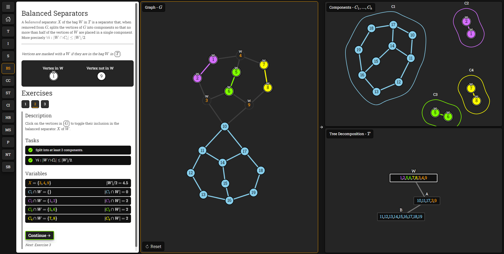
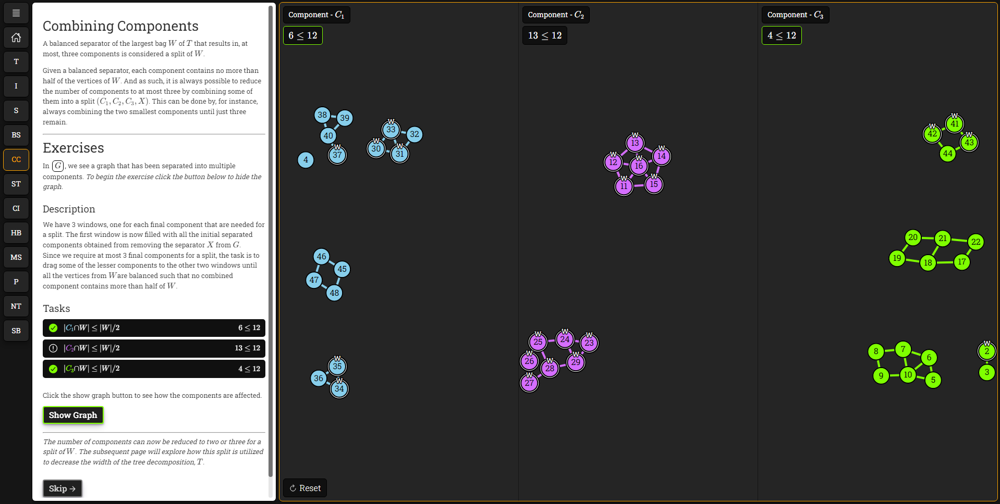
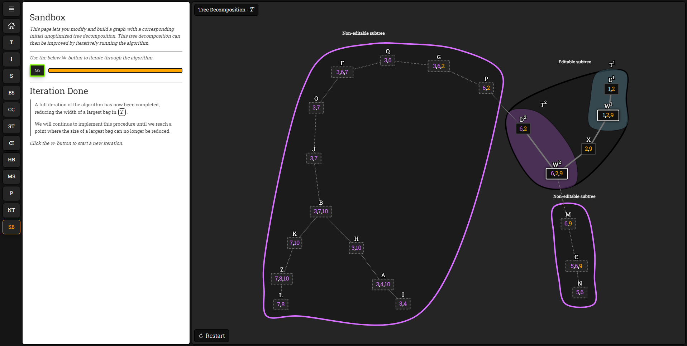

# README.md

# Korhonen's 2-Approximation for Treewidth Interactive Website

Welcome to the repository of Korhonen's 2-Approximation for Treewidth Interactive Website! This web app aims to provide an intuitive and engaging platform for learning and understanding Korhonen's 2-Approximation algorithm.

Through dynamic visualizations and interactive content, you will be introduced to the concepts of separators, tree decomposition, and dynamic programming, all key in understanding treewidth. 

## Features

- **Interactive lessons**: The website offers interactive lessons explaining the main concepts behind Korhonen's 2-Approximation for Treewidth. 

- **Dynamic Visualizations**: Through dynamic visualizations, users can better understand the complex processes of separators, splitting tree decomposition, and dynamic programming. Here are some images from the website:

     
    
    

- **Hands-on Examples**: The site provides hands-on examples to help you understand the concepts of the algorithm.

## How to use

Simply visit our [website](https://hupra.github.io/korhonen2approx/) to start learning and exploring.

## License

This project is licensed under the terms of the MIT license.